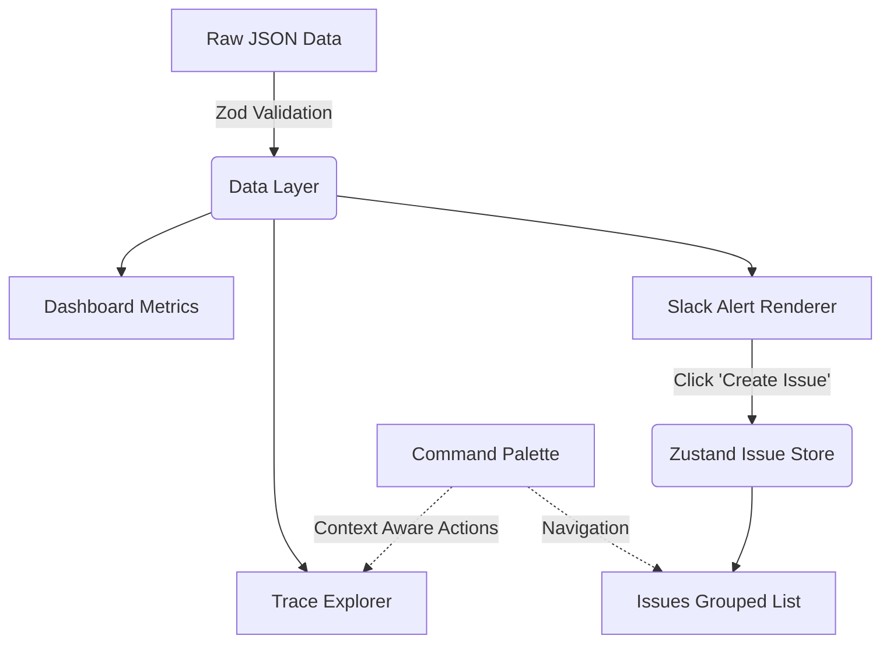

# Neo

An LLM observability console built for inspecting traces, alerting via Slack-style cards, and tracking issues in one unified workflow.

Thanks for taking the time to review this assignment. Below is an overview of how to run the app, the architecture decisions I made, and how I handled the provided data.

## Getting Started

The application is self-contained and requires no backend or database. It runs purely on the provided JSON fixtures.

```bash
bun install
bun dev
```

Open [http://localhost:3000](http://localhost:3000) to view the application.

## Features

- **Trace Explorer:** A dense, keyboard-friendly data table for scanning runs, heavily inspired by LangSmith. It includes a waterfall span viewer for deep-diving into execution steps, token usage, and latency.
- **Slack Alert Renderer:** A faithful implementation of Slack's Block Kit. It maps the provided JSON directly into interactive alert cards that support a full lifecycle (Alert → Investigating → Triage → Resolved).
- **Issue Tracker:** A Linear-style grouped list that automatically catches issues created directly from the Slack alerts. Issues carry over the original trace context so nothing gets lost.
- **Metrics Dashboard:** A high-level overview featuring a latency distribution histogram, cost-by-model breakdowns, and overarching trends derived strictly from the raw data.
- **Command Palette:** Press `Cmd+K` anywhere. It is context-aware and allows full navigation without the mouse.

## Architecture Overview

I focused heavily on keeping the architecture modular so the UI components remain decoupled from the data logic.



### The Slack Card Renderer (Block Kit)
Rather than building one massive component with a giant `switch` statement to handle the JSON blocks, I built a modular block renderer. 

The `components/slack/block-renderer.tsx` file acts as a simple registry. It maps a block's `type` (header, section, divider, etc.) directly to an isolated component. If we need to support a new Slack block type in the future, it only requires adding one new component file without touching the core logic.

The lifecycle state (Alert → Resolved) is handled via a `useReducer` pattern since it acts as a strict one-way state machine.

### The Command Palette
Instead of hardcoding global navigation, the palette uses a `useSyncExternalStore` registry. Different parts of the app can register their own contextual actions when they mount. This keeps the command palette entirely decoupled from the features themselves.

## Design Thinking

I approached this strictly as a **developer tool**. Developers need to act fast: when an alert fires, they need to quickly jump to the exact trace, gather the context of the error, and start working on the issue without losing their place.

- **Speed and Context:** The entire flow is designed so a user can read a Slack alert, instantly create an issue, and drill straight down into the trace data to get the information they need to fix it.
- **Traces:** Dense and functional. I used tabular numbers, monospace IDs, and calm status signals rather than loud, distracting pills.
- **Issues:** Opinionated and clean. Grouped naturally by status, keyboard accessible, and heavily restrained to match the "Linear" vibe requested in the prompt.
- **Aesthetics:** I used design tokens (CSS variables) over raw Tailwind colors for semantics. Accessibility was treated as a functional requirement—roving `tabindex`, arrow-key navigation in the tree, and proper `aria-labels` are baked in.

## Handling Messy Data & Trade-offs

Real production data is never perfect, and the provided fixtures were no exception. Here is how I handled the edge cases:

- **Running Traces:** Traces still in progress obviously lack an `endTime` or `latency`. I designed a deliberate "in-progress" UI state for these rather than letting them break the waterfall or showing `0ms`.
- **Concurrent Spans:** Sometimes spans overlap in time (e.g. fan-out operations). The waterfall positions spans absolutely by timestamp, ensuring overlapping spans render correctly without assuming sequential execution.
- **Rollups vs. Spans:** I trusted the top-level trace `totalCost` and `totalTokens` summaries for consistency, rather than trying to manually derive them by summing up individual `llm` spans. 

### What I Cut
To keep things focused on the core UX, I made a few deliberate cuts:
- **Kanban Board View:** I opted for a clean, Linear-style grouped list instead of a bulky Kanban card board. It felt much more aligned with the dense aesthetic.
- **Complex Issue Detail Pages:** Rather than building out a massive, standalone Issue Detail screen, I kept it minimal. The real context a developer needs lives inside the Slack alert and the Trace detail view, so I prioritized deep-linking over redundant UI.
- **Persistence & Auth:** I didn't implement backend persistence (the Zustand state resets on a hard refresh) or auth. 

### What I Would Build Next
If I had more time to expand the scope, I would:
1. **Add a true Kanban Board:** Offer a toggle between the current grouped list view and a traditional Kanban board layout.
2. **UX Polish:** Spend more dedicated time refining the micro-interactions and transitions for each individual feature to make the user experience feel even more premium.
3. **Database Persistence:** Hook the Zustand store up to a real database so issues persist and sync across clients.
